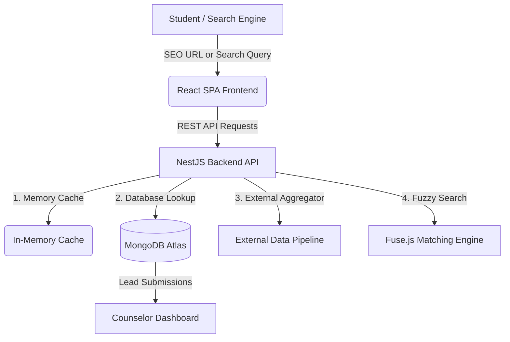

# 🎓 NextEduWise — College Discovery & Counselor Lead Platform

<p align="center">
  
  
  
  
  
  
  
</p>

---

## 📌 Overview

**NextEduWise** is a web platform designed to help students across India explore higher education options and connect directly with college admissions counselors.

The system combines flexible college search, structured programmatic SEO landing pages, fuzzy search matching, and an inquiry management dashboard for counselors.

---

## 💡 System Flow & Key Features



### 🔍 1. Search & Data Aggregation
* **Live Search & Aggregation**: Fetches college listings and details using stored database records and live external data fallback sources.
* **Image Proxying**: Server-side proxy for handling external image assets safely without client CORS conflicts.

### 🧠 2. Smart Search & Matching
* **Local Caching & Database First**: Queries MongoDB first before falling back to external requests.
* **Name & Acronym Handling**: Normalizes institution names, common acronyms, and locations.
* **Fuzzy Search Fallback**: Uses Fuse.js fuzzy string matching to return relevant suggestions even when names are misspelled or incomplete.

### 🚀 3. Dynamic SEO & Landing Pages
* **Course & City Pages**: Supports clean, crawlable URLs for course and location filters (e.g., `/engineering-colleges/bhopal`, `/mba-colleges/mumbai`).
* **Sitemap Generation**: Automatically updates XML sitemaps based on live college records.
* **Structured Data**: Includes JSON-LD schema markup (`EducationalOrganization`, `BreadcrumbList`, `FAQPage`) for enhanced search visibility.

### 💼 4. Lead Capture & Counselor CRM
* **Inquiry Forms**: Embedded forms and modals for students to submit contact details and course interests.
* **Role-Based Counselor Dashboard**: Secure JWT-authenticated dashboard to view, filter, and track lead status (Pending, Contacted, Enrolled, Archived).
* **Automated Data Retention**: Scheduled maintenance task to clean up old lead records in accordance with retention policies.

---

## 🛠 Tech Stack

| Layer | Technology | Purpose |
| :--- | :--- | :--- |
| **Frontend** | React 18, Vite 5, Tailwind CSS | Fast responsive user interface |
| **State Management** | Zustand | Client-side state store for filters, modals, and user sessions |
| **Backend API** | NestJS 10 (TypeScript) | Modular Node.js REST API with dependency injection |
| **Database** | MongoDB Atlas, Mongoose | Flexible document storage for colleges, leads, and counselors |
| **Search Engine** | Fuse.js | Client/Server fuzzy string matching for search queries |
| **Containerization** | Docker (Multi-stage) | Production build isolation for API and web containers |
| **Web Server** | Nginx Alpine | Static hosting, SPA routing (`try_files`), and API reverse proxying |

---

## 📁 Repository Structure

```
.
├── apps/
│   ├── api/                     # NestJS Backend API
│   │   ├── src/
│   │   │   ├── auth/            # JWT Authentication & Authorization
│   │   │   ├── colleges/        # Data Scraper, Fuzzy Matcher, Sitemap Generator
│   │   │   ├── counselors/      # Counselor Account Services
│   │   │   ├── health/          # System Health Endpoint
│   │   │   ├── leads/           # Lead Management & Cron Cleanup
│   │   │   └── main.ts          # API Bootstrap & Validation
│   │   ├── Dockerfile           # Multi-Stage API Container Build
│   │   └── package.json
│   └── web/                     # React + Vite Frontend
│       ├── public/              # Static Assets & Configuration
│       ├── src/
│       │   ├── components/      # Reusable UI Components, Modals, SEO Headers
│       │   ├── pages/           # Landing Pages, College Details, Counselor CRM
│       │   ├── stores/          # Zustand State Management
│       │   └── App.tsx          # Client-side Routes & App Entry
│       ├── nginx.conf           # Nginx Proxy & SPA Routing Rules
│       ├── Dockerfile           # Multi-Stage Frontend Build
│       └── package.json
├── docker-compose.yml           # Local Multi-Container Setup
└── README.md                    # Project Documentation
```

---

## 🚀 Quick Start Guide

### Option A: Run with Docker Compose (Recommended)

```bash
# 1. Clone the repository
git clone https://github.com/MrAdrsMishra/campusbridge.git
cd campusbridge

# 2. Start services
docker compose up --build -d
```

- **Frontend App**: `http://localhost:8000`
- **Backend API**: `http://localhost:3000`

---

### Option B: Run Locally for Development

#### 1. Backend Setup (`apps/api`)
```bash
cd apps/api
cp .env.example .env
# Configure MONGODB_URI and JWT_SECRET in .env
npm install
npm run start:dev
```

#### 2. Frontend Setup (`apps/web`)
```bash
cd apps/web
cp .env.example .env
# Verify VITE_API_URL is set to http://localhost:3000
npm install
npm run dev
```

---

## 🌐 API Reference

| Method | Endpoint | Description | Query Parameters / Body |
| :--- | :--- | :--- | :--- |
| `GET` | `/colleges/search` | Search colleges by keyword, city, or state | `query`, `city`, `state` |
| `GET` | `/colleges/details` | Retrieve college detail records | `name`, `slug`, `seriesId` |
| `GET` | `/colleges/suggestions` | Search auto-complete suggestions | `name`, `city`, `course` |
| `GET` | `/colleges/image` | Proxy image assets | `url` |
| `GET` | `/sitemap.xml` | Generate dynamic XML sitemap | None |
| `POST` | `/leads` | Submit student lead inquiry | `{ name, phone, course, city }` |
| `POST` | `/auth/login` | Counselor CRM login | `{ email, password }` |

---

## 🛡 License & Credits

Designed and developed by **Adarsh Mishra**. All rights reserved.

